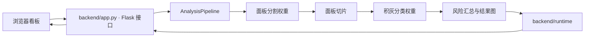

# 架构与目录约定

## 组件关系

此图描述应用默认的两阶段推理流程。另有显式演示模式和需要额外权重的多缺陷分割分支。

- `frontend/` 只包含浏览器资源，由 Flask 的静态文件路由提供。
- `backend/app.py` 定义 HTTP 路由，调用 `AnalysisPipeline` 完成分析和看板数据构建。
- `backend/config.py` 以当前文件位置计算仓库根目录，集中管理前端、样本、权重和运行目录。
- `models/trained/` 存放应用权重，`models/pretrained/` 存放训练起点。
- `data/configs/` 存放可提交的数据配置，`data/datasets/` 存放本地数据，不纳入 Git。
- `backend/runtime/` 由配置加载时创建，用于上传文件、结果图和分析历史。
- `backend/runs/` 为两阶段训练的默认输出目录。

## 目录迁移

| 原目录或文件 | 新位置 |
| --- | --- |
| `011 大数据可视化系统数据分析通用模版/` | `frontend/` |
| `backend/models/*.pt` | `models/trained/` |
| 根目录 `yolov8n-*.pt` | `models/pretrained/` |
| `backend/data/pv_surface_seg.yaml` | `data/configs/pv_surface_seg.yaml` |
| `backend/samples/` | `samples/` |
| 老师提供的分割 / 分类数据 | 导入至本地 `data/datasets/panel-seg/`、`tile-cls/` |
| 原交付说明、历史环境 | `docs/reference/` |
| 申报书、打包清单、原验证报告 | 本地 `docs/private/` |

配置、样本生成与两阶段训练入口已同步以上路径。原推理模块通过 `AppConfig` 读取目录，不依赖旧的前端和模型目录名。
